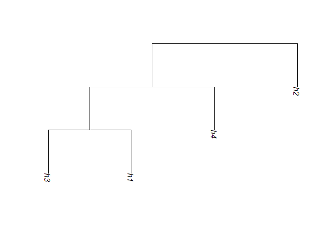

<!-- README.md is generated from README.Rmd. Please edit that file -->
perfectphyloR
=============

The R package perfectphyloR reconstructs perfect phylogenies underlying a sample of DNA sequences, at a focal single-nucleotide variant (SNV). A perfect phylogeny is a rooted binary tree that recursively partitions DNA sequences. Their nested partition structures provide insight into the pattern of ancestry of DNA sequence data. For example, disease sequences may cluster together in a local partition indicating that they arise from a common ancestral haplotypes. Therefore, the availability of an R package that reconstructs perfect phylogenies should be useful to researchers seeking the ancestral structure of their sequence data.

Installation
------------

You can install perfectphyloR from github with:

``` r

# install.packages("devtools")
devtools::install_github("cbhagya/perfectphyloR")
```

Example
-------

To reconstruct a perfect phylogeny, you have to first create an object of class `hapMat`. `createHapMat()` allows you to create this new object. To illustrate, we consider a toy example with 4 haplotypes and 4 SNVs.

``` r
library(perfectphyloR)
 # Haplotype matrix
 haplo_mat <- matrix(c(1,1,1,0,
                       0,0,0,0,
                       1,1,1,1,
                       1,0,0,0), byrow = TRUE, ncol = 4)
 # SNV names
 SNV_names <- c(paste("SNV", 1:4, sep = ""))
 # Haplotype names
 hap_names <- c("h1", "h2", "h3", "h4")
 # SNV positions in base pairs
 SNV_posns <- c(1000, 2000, 3000, 4000)
 ex_hapMat <- createHapMat(hapmat = haplo_mat,
                           snvNames = SNV_names,
                           hapNames = hap_names ,
                           posns = SNV_posns)
 ex_hapMat
#> $hapmat
#>    SNV1 SNV2 SNV3 SNV4
#> h1    1    1    1    0
#> h2    0    0    0    0
#> h3    1    1    1    1
#> h4    1    0    0    0
#> 
#> $posns
#> [1] 1000 2000 3000 4000
#> 
#> attr(,"class")
#> [1] "hapMat"
```

Once the `hapMat` object is created, you can reconstruct the perfect phylogeny partition with the function `reconstructPP()`. To illustrate, we show how to reconstruct the partition at the second SNV position of `ex_hapMat`.

``` r
# Reconstruct the partition at the SNV position 2.
rdend <- reconstructPP(hapMat = ex_hapMat,
                        focalSNV = 2,
                        minWindow = 1,
                        sep = "-")
```

You can use `plotDend()` to plot the dendrogram structure of reconstructed partitions at a focal point. The following example shows how you can plot the reconstructed partition `rdend`.

``` r
plotDend(rdend, direction = "downwards")
```


